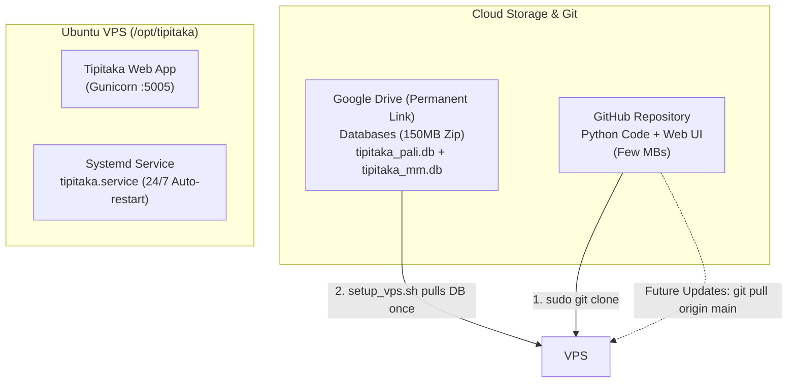

# တိပိဋက Web App - Modern VPS Deployment & Maintenance Guide
(GitHub + Google Drive Hybrid Architecture - အဆင့် ၂ ဆင့်တည်းဖြင့် ပြီးပြည့်စုံသော တပ်ဆင်မှု လမ်းညွှန်)

---

## 📌 စနစ် ဖွဲ့စည်းပုံ အကျဉ်းချုပ် (Modern System Architecture)

ဤစနစ်သည် **Local PC နှင့် Cloudflare Tunnel များ ဖွင့်ထားရန် လုံးဝ မလိုအပ်တော့ဘဲ** Cloud အခြေပြု ခေတ်မီ စံပြုနည်းလမ်းဖြင့် တည်ဆောက်ထားပါသည်:



| ကဏ္ဍ | စီမံခန့်ခွဲမှု ပုံစံ | အားသာချက် |
| :--- | :--- | :--- |
| **ကုဒ်ဖိုင်များ (Code & UI)** | **GitHub Repository** | ပေါ့ပါးသွက်လက်ပြီး Version Control စနစ်တကျ ရှိခြင်း၊ `git pull` ဖြင့် ၂ စက္ကန့်အတွင်း Update ရရှိခြင်း |
| **ဒေတာဘေ့စ် (Databases)** | **Google Drive အမြဲတမ်းလင့်ခ်** | ၈၅၀ MB ကျော်ရှိသော ပုံသေဒေတာများကို Initial Setup တွင် ၁ ကြိမ်သာ အလိုအလျောက် ဆွဲယူသိမ်းဆည်းခြင်း |
| **Local PC မှီခိုမှု** | **လုံးဝ ကင်းစင် (0%)** | Local PC ဖွင့်ထားစရာမလို၊ Tunnel ဖွင့်ထားစရာမလိုဘဲ VPS သည် Cloud ပေါ်မှ တိုက်ရိုက် လည်ပတ်ခြင်း |

---

## 🚀 အပိုင်း (၁) - VPS ပေါ်တွင် အသစ် စတင်တပ်ဆင်ခြင်း (Initial Setup)

အသစ်စက်စက် Ubuntu / Debian VPS တစ်ခုပေါ်တွင် အောက်ပါ **အဆင့် ၂ ဆင့်တည်းဖြင့်** တိပိဋက Web App တစ်ခုလုံးကို ပြီးပြည့်စုံစွာ တပ်ဆင်နိုင်ပါသည်:

### အဆင့် ၁ - GitHub မှ Code များကို VPS ပေါ်သို့ Clone ခေါ်ယူခြင်း
VPS Terminal (SSH) ထဲတွင် အောက်ပါ command ကို run ပါ -
```bash
sudo git clone https://github.com/uzinlay85/tipitaka_web_app_By_uzinlay.git /opt/tipitaka
cd /opt/tipitaka
```

### အဆင့် ၂ - Automated Setup Script ကို run လိုက်ခြင်း
```bash
sudo bash setup_vps.sh
```

> [!NOTE]
> **`setup_vps.sh` က အလိုအလျောက် ဆောင်ရွက်ပေးသွားမည့် အလုပ်များ:**
> 1. လိုအပ်သော Linux packages များ (`python3-venv`, `pip`, `unzip`, `git`, `curl`) သွင်းယူခြင်း။
> 2. ဆရာတော်၏ Google Drive အမြဲတမ်းလင့်ခ် (`1WX-09wlmRDma__j4ErLTK8jrSn8a1Fbx`) မှ ဒေတာဘေ့စ်များ (`tipitaka_pali.db` နှင့် `tipitaka_mm.db`) ကို အလိုအလျောက် ဆွဲယူဖြည်ချပေးခြင်း။
> 3. Python Virtual Environment (`venv`) ဆောက်ပြီး `requirements.txt` နှင့် `gunicorn` သွင်းယူခြင်း။
> 4. ဖိုင် Permission နှင့် ပိုင်ဆိုင်ခွင့်များ မှန်ကန်စွာ သတ်မှတ်ပေးခြင်း။
> 5. ၂၄ နာရီ မပြတ်လည်ပတ်မည့် Systemd Service (`/etc/systemd/system/tipitaka.service`) ဖန်တီး၍ auto-start စတင်ပေးခြင်း။

တပ်ဆင်ပြီးစီးပါက VPS ၏ Port `5005` (`127.0.0.1:5005`) တွင် တိပိဋက Web App စတင်လည်ပတ်နေမည် ဖြစ်ပါသည်။

---

## 🔄 အပိုင်း (၂) - နောင်တွင် ကုဒ်များ Update ပြုလုပ်နည်း (1-Line Instant Update)

နောင်အခါ Local PC ပေါ်တွင် ကုဒ်အသစ်များ ပြင်ဆင်ပြီး GitHub သို့ `git push` လုပ်ပြီးပါက၊ VPS ပေါ်တွင် Database များကို ထပ်မံဒေါင်းလုဒ်ဆွဲစရာ မလိုတော့ဘဲ **အောက်ပါ ၁ ကြောင်းတည်းသော command ဖြင့် ၂ စက္ကန့်အတွင်း** ချက်ချင်း Update ရရှိပါမည်:

```bash
cd /opt/tipitaka && git pull origin main && sudo systemctl restart tipitaka
```

---

## 🛠️ အပိုင်း (၃) - စနစ် စောင့်ကြည့်ခြင်းနှင့် ထိန်းသိမ်းမှု Commands (Maintenance)

### ၁။ Web App လည်ပတ်နေမှု အခြေအနေ (Status) စစ်ဆေးခြင်း
```bash
sudo systemctl status tipitaka
```
*(အစိမ်းရောင် `active (running)` ပေါ်နေပါက ပုံမှန် အလုပ်လုပ်နေပါသည်)*

### ၂။ Web App ကို Restart လုပ်ခြင်း
```bash
sudo systemctl restart tipitaka
```

### ၃။ Live Logs များကို အချိန်နှင့်တစ်ပြေးညီ စောင့်ကြည့်ခြင်း
```bash
sudo journalctl -u tipitaka -f
```
*(ထွက်ရန်: `Ctrl + C`)*

### ၄။ Port 5005 ဖွင့်လှစ်ထားမှု စစ်ဆေးခြင်း
```bash
sudo ss -tulpn | grep 5005
# သို့မဟုတ်
sudo netstat -tlpn | grep 5005
```

---

## 🌐 အပိုင်း (၄) - Domain နှင့် ချိတ်ဆက်ခြင်း (Cloudflare Zero Trust Tunnel သို့မဟုတ် Nginx)

VPS ပေါ်တွင် လည်ပတ်နေသော တိပိဋက Web App (Port `5005`) ကို Domain အမည် (ဥပမာ `tipi.upanna.top`) ဖြင့် အင်တာနက်ပေါ်မှ ချိတ်ဆက်ဖတ်ရှုနိုင်ရန် အောက်ပါ နည်းလမ်း ၂ မျိုးအနက် အဆင်ပြေရာကို သုံးနိုင်ပါသည်:

---

### နည်းလမ်း (က) - Cloudflare Zero Trust Tunnel ဖြင့် ချိတ်ဆက်ခြင်း (အလွယ်ဆုံးနှင့် အလုံခြုံဆုံး အကြံပြုနည်းလမ်း - Recommended)

ဤနည်းလမ်းသည် **Port 80/443 ဖွင့်စရာမလို**၊ **SSL လက်မှတ်များ စီမံစရာမလို**၊ **Nginx သွင်းစရာမလိုဘဲ** Cloudflare ၏ Cloudflare daemon (`cloudflared`) ဖြင့် တိုက်ရိုက် ချိတ်ဆက်ပေးသော အကောင်းဆုံး နည်းလမ်းဖြစ်ပါသည်:

#### အားသာချက်များ:
1. **Firewall / Port ဖွင့်ရန်မလိုခြင်း:** VPS ၏ Port များကို အင်တာနက်သို့ ဖွင့်မပေးရသဖြင့် Hacker များ တိုက်ခိုက်မှုမှ ၁၀၀% ကင်းဝေးခြင်း။
2. **အခမဲ့ အမြဲတမ်း SSL (HTTPS):** Cloudflare Edge က HTTPS လက်မှတ်ကို အလိုအလျောက် ထုတ်ပေးပြီး သက်တမ်းအမြဲတမ်း တိုးပေးခြင်း။
3. **DDoS Protection & Caching:** Cloudflare ၏ Global CDN က အမြန်နှုန်း မြှင့်တင်ပေးပြီး တိုက်ခိုက်မှုများကို ကာကွယ်ပေးခြင်း။

#### အဆင့်ဆင့် ပြုလုပ်ပုံ (၁ မိနစ်အတွင်း ပြီးစီး):
၁။ [Cloudflare Dashboard](https://dash.cloudflare.com) သို့ ဝင်ရောက်ပြီး ဘယ်ဘက်မီနူးမှ **Zero Trust** ကို နှိပ်ပါ။  
၂။ ဘယ်ဘက်ခြမ်းရှိ **Networks** -> **Tunnels** သို့ သွားပြီး **"Add a tunnel"** (သို့မဟုတ် **"Create a tunnel"**) ကို နှိပ်ပါ။  
၃။ **Select Cloudflare Tunnel (recommended)** ကို ရွေးပြီး **Next** နှိပ်ပါ။  
၄။ Tunnel အမည် ထည့်ပါ (ဥပမာ: `tipitaka-vps`) -> **Save tunnel** ကို နှိပ်ပါ။  
၅။ **Choose your environment:** တွင် **"Debian"** သို့မဟုတ် **"Ubuntu" (64-bit)** ကို ရွေးချယ်ပါ။  
၆။ Cloudflare က ထုတ်ပေးသော Command တစ်ကြောင်းလုံးကို Copy ယူပြီး VPS SSH Terminal တွင် Paste ချ၍ Run လိုက်ပါ:  
   ```bash
   curl -L --output cloudflared.deb https://github.com/cloudflare/cloudflared/releases/latest/download/cloudflared-linux-amd64.deb && sudo dpkg -i cloudflared.deb && sudo cloudflared service install <YOUR_TOKEN>
   ```
   *(မှတ်ချက်: `<YOUR_TOKEN>` နေရာတွင် Cloudflare က ထုတ်ပေးသော Token ပါဝင်ပြီးဖြစ်ပါသည်)*  
၇။ Terminal တွင် Run ပြီးသည်နှင့် Cloudflare ဝဘ်စာမျက်နှာတွင် **"Connected"** (အစိမ်းရောင်) ပြသလာပါမည်။ **Next** ကို နှိပ်ပါ။  
၈။ **Public Hostname** စာမျက်နှာတွင် အောက်ပါအတိုင်း ဖြည့်စွက်ပါ:
   - **Subdomain:** `tipi`
   - **Domain:** `upanna.top` (ဆရာတော်၏ domain ကို ရွေးချယ်ပါ)
   - **Type:** `HTTP`
   - **URL:** `localhost:5005` (သို့မဟုတ် `127.0.0.1:5005`)
၉။ အောက်ခြေရှိ **Save hostname** (သို့မဟုတ် **Save tunnel**) ကို နှိပ်လိုက်သည်နှင့် ချက်ချင်း ပြီးစီးသွားပါပြီ!  
ယခုအခါ Browser မှ `https://tipi.upanna.top` သို့ ဝင်ရောက်ဖတ်ရှုနိုင်ပါပြီ ဘုရား။

---

### နည်းလမ်း (ခ) - Nginx Reverse Proxy + Certbot SSL ဖြင့် ချိတ်ဆက်ခြင်း (ရိုးရာ Standard နည်းလမ်း)

အကယ်၍ VPS တွင် Cloudflare Tunnel အစား Nginx Web Server ဖြင့် တိုက်ရိုက် မောင်းနှင်လိုပါက အောက်ပါအတိုင်း ပြုလုပ်နိုင်ပါသည်:

#### ၁။ Nginx Configuration ဖိုင် ဖွင့်ပါ
```bash
sudo nano /etc/nginx/sites-available/tipitaka
```

#### ၂။ အောက်ပါ Configuration ကို ထည့်သွင်းပါ
```nginx
server {
    server_name tipi.upanna.top;

    client_max_body_size 50M;

    location / {
        proxy_pass http://127.0.0.1:5005;
        proxy_set_header Host $host;
        proxy_set_header X-Real-IP $remote_addr;
        proxy_set_header X-Forwarded-For $proxy_add_x_forwarded_for;
        proxy_set_header X-Forwarded-Proto $scheme;
        
        # WebSocket and timeout support
        proxy_read_timeout 300s;
        proxy_connect_timeout 75s;
    }
}
```

#### ၃။ Config ကို Enable လုပ်ပြီး Nginx ကို Restart လုပ်ပါ
```bash
sudo ln -sf /etc/nginx/sites-available/tipitaka /etc/nginx/sites-enabled/
sudo nginx -t
sudo systemctl restart nginx
```

#### ၄။ အခမဲ့ SSL လက်မှတ် (HTTPS) ထည့်သွင်းပါ
```bash
sudo certbot --nginx -d tipi.upanna.top
```

---

## 💾 အပိုင်း (၅) - အင်တာနက်မရှိသောအခါ Offline / USB Stick ဖြင့် တပ်ဆင်နည်း

အကယ်၍ VPS သို့မဟုတ် စက်အသစ်တွင် Google Drive မှ တိုက်ရိုက်ဒေါင်းလုဒ် မဆွဲလိုဘဲ Offline USB Stick ဖြင့် တပ်ဆင်လိုပါက:

၁။ `Tipitaka_Deploy_Package` ဖိုဒါထဲရှိ `tipitaka_vps.zip` (~150 MB) ကို USB Stick ထဲသို့ ကူးထည့်ပါ။  
၂။ VPS ထဲသို့ `scp` သို့မဟုတ် WinSCP ဖြင့် တိုက်ရိုက် ကူးတင်ပါ:
```powershell
scp -P 2213 tipitaka_vps.zip zinko@172.245.210.149:/opt/tipitaka/
```
၃။ `/opt/tipitaka` ထဲတွင် `tipitaka_vps.zip` ရှိနေပါက `setup_vps.sh` ကို run လိုက်သည်နှင့် Google Drive မှ ထပ်မဆွဲတော့ဘဲ ထို zip ဖိုင်မှ database များကို အလိုအလျောက် ဖြည်ချအသုံးပြုသွားမည် ဖြစ်ပါသည်။
